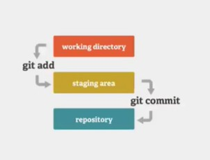
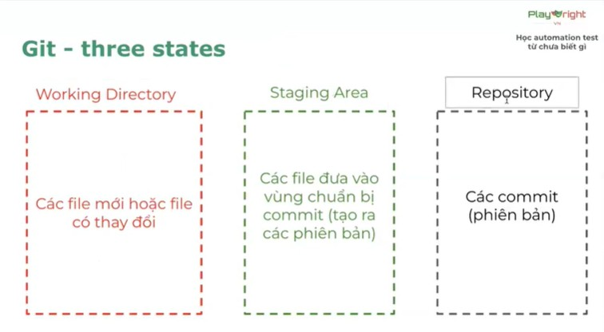

# Buổi 2 — Git + JavaScript Basic (Ghi chép)

> Mục tiêu của buổi: nắm bản chất quản lý phiên bản bằng Git + làm quen JavaScript căn bản để bắt đầu học Automation sau này.

---

## Bức tranh tổng quan (vì sao học buổi này)
- Làm dự án thật thì **không ai code một mình mãi** → phải biết cách lưu phiên bản + làm việc nhóm.
- Git giúp:
  - Lưu lịch sử thay đổi
  - So sánh thay đổi
  - Quay lại phiên bản cũ khi lỗi
  - Làm nhóm đỡ “gửi file qua lại”
- JavaScript là nền để đi vào Playwright/Automation (vì Playwright chạy tốt với JS/TS).

---

## 1) Version Control System (VCS) là gì?

### 1.1. Định nghĩa
- **Version** = phiên bản  
- **Control** = kiểm soát  
- **System** = hệ thống  
→ **VCS = hệ thống kiểm soát phiên bản** của code/file theo thời gian.

### 1.2. VCS giải quyết vấn đề gì?
- Biết được **ai** sửa, **sửa lúc nào**, **sửa cái gì**.
- Khi sửa sai: **quay về bản ổn** nhanh.
- Làm nhóm: tránh chồng chéo, tránh “mất dữ liệu”.

### 1.3. Các loại VCS (nhớ theo ý)
---

1. **Local VCS (cục bộ)**  
   - Tự copy file: `backup1`, `backup2`…
   - Nhược: dễ rối, mất máy là mất.

2. **Centralized VCS (tập trung)**  
   - Có server trung tâm (mọi người lấy về từ đó).
   - Nhược: server/mạng có vấn đề là “kẹt”.

3. **Distributed VCS (phân tán)**  
   - Mỗi người có “bản repo đầy đủ” ở máy + có server.
   - Ưu: an toàn hơn, linh hoạt hơn → **Git thuộc nhóm này**.

---

## 2) Git là gì? Git khác GitHub thế nào?

### 2.1. Git
- Git là công cụ **quản lý phiên bản dạng Distributed**.
- Chạy chủ yếu bằng command line/terminal.
- Git quản lý theo “lịch sử commit” (mỗi commit = một mốc phiên bản).

### 2.2. GitHub
- GitHub là **nơi lưu repo trên web** (host repository) + hỗ trợ làm việc nhóm.
- Hiểu nhanh:
  - **Git = công cụ**
  - **GitHub = nền tảng lưu trữ & cộng tác**

---

## 3) Bản chất Git: 3 vùng quan trọng (Three states)

### 3.1. 3 vùng
---
**Ảnh minh họa**

 

---
1. **Working Directory**  
   - Nơi mình đang sửa file (bản nháp).

2. **Staging Area**  
   - Nơi “chọn file” sẽ đưa vào commit.
   - Kiểu như giỏ hàng trước khi thanh toán.

3. **Repository (.git)**  
   - Nơi lưu các commit (lịch sử phiên bản).

### 3.2. Luồng làm việc chuẩn
- Sửa file (Working)
- `git add` (đưa sang Staging)
- `git commit` (đưa vào Repository)

---

## 4) Thực hành Git: tạo 2 commit (đúng flow)

### 4.1. Bài tập mục tiêu
- Commit 1: có `file1.txt`
- Commit 2: có `file2.txt` và `file3.txt`

### 4.2. Các bước (kèm ý nghĩa lệnh)
1. `git init` (khởi tạo repo Git trong thư mục hiện tại)
2. Tạo `file1.txt`
3. `git add file1.txt` (đưa file1 vào staging)
4. `git commit -m "chore: add file1"` (tạo commit đầu)

5. Tạo `file2.txt`, `file3.txt`
6. Add file (có nhiều cách):
   - `git add file2.txt file3.txt` (add 2 file một lần)
   - hoặc `git add file2.txt` rồi `git add file3.txt` (add từng file)
   - hoặc `git add .` (add tất cả thay đổi trong folder hiện tại)
7. `git commit -m "chore: add file2 and file3"` (tạo commit thứ 2)

---

## 5) Làm với folder + cd

### 5.1. File nằm trong folder con
Ví dụ có `folderA/file4.txt`:
- `git add folderA/file4.txt` (add đúng đường dẫn)
- `git commit -m "chore: add file4"`

### 5.2. Lệnh `cd` để di chuyển thư mục
- `cd folderA` (đi vào folderA)
- `cd ..` (lùi về thư mục cha)

> Ghi nhớ: đứng đúng thư mục dự án để chạy lệnh cho khỏi nhầm.

---

## 6) Các lệnh Git cần thuộc trong buổi

### 6.1. `git status` (xem trạng thái)
- Xem file nào:
  - mới tạo
  - đã sửa
  - đã add chưa
- Nhận biết nhanh:
  - file **chưa add** → đang ở Working
  - file **đã add** → đang ở Staging

### 6.2. `git log` (xem lịch sử commit)
- Xem danh sách commit (id, author, date, message)
- Nếu bị “kẹt màn hình log” → **bấm `Q` để thoát** (quit).

---

## 7) Sửa file rồi commit tiếp (tư duy phiên bản)
- File commit rồi **vẫn sửa bình thường**.
- Khi sửa → Git báo modified.
- Muốn lưu phiên bản mới:
  - `git add .` (đưa thay đổi vào staging)
  - `git commit -m "fix: update content"` (tạo phiên bản mới)

---

## 8) Cấu hình Git: name/email (tránh lỗi commit)

### 8.1. Vì sao cần config?
- Khi commit, Git cần biết “ai là người commit” → name/email.

### 8.2. Config GLOBAL (cho toàn máy)
- `git config --global user.name "Ten Cua Minh"` (đặt tên hiển thị)
- `git config --global user.email "emailcuaminh@example.com"` (đặt email)

### 8.3. Config LOCAL (riêng từng dự án)
> Chỉ dùng khi muốn mỗi dự án một name/email khác nhau.
- `git config user.name "Ngoc Tran"` (đặt name cho repo này)
- `git config user.email "tranngoctt@gmail.com"` (đặt email cho repo này)

---

## 9) Auto Save trong VS Code (lỗi hay gặp)
- Quên save file → chạy `git status` thấy “không có gì thay đổi” dù mình vừa sửa.
- Bật Auto Save:
  - VS Code → **File → Auto Save** (bật ON)
- Dấu hiệu file chưa lưu: tab có chấm tròn.

---

## 10) Commit message: Convention (viết commit cho “đẹp”)

### 10.1. Format đơn giản
- `type: nội dung ngắn gọn`

### 10.2. Type hay dùng
- `chore`: việc lặt vặt (tạo file, dọn dẹp, chỉnh format, config)
- `feat`: thêm tính năng
- `fix`: sửa lỗi

### 10.3. Ví dụ
- `chore: init project`
- `feat: add login test`
- `fix: update selector for button`

> Quy tắc nhỏ: type viết thường + có dấu `:` + có khoảng trắng sau `:`.

---

## 11) Chốt lại Git Workflow (một vòng đời thay đổi)
1. Sửa/tạo file
2. `git status` (kiểm tra)
3. `git add ...` (chọn file đưa vào staging)
4. `git commit -m "..."` (lưu phiên bản)
5. (Lên GitHub sẽ học sâu hơn) `git push` (đẩy code lên server)

---

# 12) JavaScript Basic

## 12.1. JavaScript là gì?
- JavaScript là ngôn ngữ lập trình phổ biến.
- Chạy trong browser và chạy được trên máy nhờ Node.js.
- Mục tiêu buổi này: làm quen cú pháp cơ bản (biến, kiểu dữ liệu, so sánh, điều kiện…).

---

## 13) Chạy JS bằng Node (làm quen)
### 13.1. In ra màn hình
- `console.log("Hello");` (in ra chữ Hello)

### 13.2. Chạy file JS
- `node tenFile.js` (chạy file JS bằng Node)

> Nếu file nằm trong thư mục con:
- `node folder/tenFile.js` (chạy theo đường dẫn)

---

## 14) Comment (ghi chú trong code)
### 14.1. Comment 1 dòng
- `// nội dung comment` (từ `//` đến hết dòng)

### 14.2. Comment nhiều dòng
- `/* comment nhiều dòng */`

### 14.3. Phím tắt VS Code
- `Ctrl + /` (Windows) (bật/tắt comment nhanh)

---

## 15) Biến và hằng (var / let / const)

### 15.1. Công thức khai báo
- `<từ khóa> <tên biến> = <giá trị>;`

### 15.2. var / let / const
- `var`:
  - cú pháp cũ
  - có thể khai báo lại → dễ rối
- `let`:
  - cú pháp mới
  - không cho khai báo lại trong cùng scope
  - scope theo block `{ }`
- `const`:
  - hằng số (không gán lại)
  - ưu tiên dùng mặc định

### 15.3. Nguyên tắc dùng nhanh
- Ưu tiên `const`
- Chỉ dùng `let` khi **chắc chắn cần đổi giá trị**
- Tránh `var` nếu không cần

---

## 16) Kiểu dữ liệu cơ bản
- `number`: số (vd: `1`, `2.5`, `-10`)
- `string`: chuỗi (vd: `"abc"`, `'3543532fg dgsfdg'`)
- `boolean`: `true` / `false`

### 16.1. `typeof` để xem kiểu dữ liệu
- `typeof x` (trả về kiểu của x)

---

## 17) String nâng hơn: template literal (backtick)
- Dùng dấu **backtick**: `` `...` ``
- Nhét biến vào chuỗi bằng `${}`:
  - `` `Hoc sinh ${age}` ``

> Nhớ: backtick khác nháy đơn `'` và nháy kép `"`.

---

## 18) Toán tử so sánh (quan trọng)
### 18.1. So sánh cơ bản
- `>`, `<`, `>=`, `<=`
- `==`, `!=`
- `===`, `!==`

### 18.2. `==` vs `===`
- `==` (loose): có thể tự ép kiểu rồi so sánh
- `===` (strict): so sánh **cả kiểu + giá trị**

> Thói quen tốt: ưu tiên dùng `===` để tránh bug.

---

## 19) Toán tử logic
- `&&` (AND): đúng khi **tất cả điều kiện đúng**
- `||` (OR): đúng khi **ít nhất 1 điều kiện đúng**

Gợi nhớ nhanh:
- AND `&&`: chỉ true khi `T && T`
- OR `||`: chỉ false khi `F || F`

---

## 20) Toán tử tăng/giảm: ++ / --
### 20.1. Prefix
- `++a` (tăng trước rồi mới dùng giá trị)

### 20.2. Postfix
- `a++` (dùng giá trị trước rồi mới tăng)

---

## 21) Toán tử toán học
- `+`, `-`, `*`, `/`
- Tránh chia cho 0 (kết quả là Infinity= vô cực).

---

## 22) Câu điều kiện `if` (bước đầu của tư duy lập trình)

### 22.1. Mẫu cơ bản
- `if (điều kiện) { ... }` (điều kiện đúng thì chạy)

### 22.2. Ghép điều kiện
- Dùng `&&` / `||` để ghép.
- Ví dụ: “giờ hợp lệ” kiểu `hour > 6 && hour < 11` (ý nghĩa: lớn hơn 6 và nhỏ hơn 11)

---

